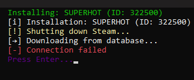

# How to Fix "Connection Failed" Error

When trying to connect to the API, you may encounter the following error:

This error usually occurs because your antivirus is preventing the application from accessing the internet.

---

## ⚠️ Warning
- **Do not leave your antivirus disabled for long periods.**
- **Adding an exception is safer than fully disabling your antivirus.**

---

## Step-by-Step Solution

### 1. Identify Your Active Antivirus
Check which antivirus software is running on your machine (e.g., Windows Defender, Avast, Kaspersky, Norton).

---

### 2. Temporarily Disable Antivirus
1. Open your antivirus application.  
2. Look for **real-time protection** or **internet protection** settings.  
3. Temporarily disable the protection.

---

### 3. Test API Connection
- Relaunch your application.  
- Check if the connection succeeds.

---

### 4. Add an Exception (Recommended)
1. In your antivirus, navigate to **Exclusions** or **Exceptions**.  
2. Add your application's path or script to the exceptions list.  
3. Re-enable the antivirus.

---

### 5. Restart Your Application
- After adding the exception, restart your application to ensure the error no longer occurs.

---

## 💡 Additional Tips
- If the problem persists, check your **firewall settings**.  
- Always re-enable antivirus protections after testing.
