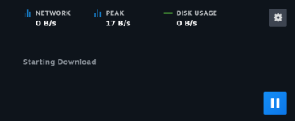

# How to Fix "Game Download Stuck at 0KB" Error

When trying to download a game, you may encounter the following error:

This error usually occurs due to regional restrictions or network issues preventing the launcher from connecting to the game server.

---

## ⚠️ Warning
- **Do not leave your VPN connected to random regions for extended periods.**
- **Always use a reliable VPN provider** to avoid connection drops or security risks.

---

## Step-by-Step Solution

### 1. Install a VPN
If you don't already have a VPN installed:
1. Choose a reputable VPN service (e.g., NordVPN, ExpressVPN).  
2. Download and install the VPN application on your device.

---

### 2. Connect to an Asian Server
1. Open your VPN application.  
2. Select a server located in **Asia** (e.g., Japan, Singapore, South Korea).  
3. Ensure the VPN connection is active and stable.

---

### 3. Restart Steam
- Close Steam completely.  
- Reopen it while the VPN is active.  
- Check if the download progresses beyond **0KB**.

---

### 4. Test Alternative Servers (Optional)
- If the download is still stuck, try connecting to a different Asian server.  
- Some servers may perform better depending on network congestion.

---

### 5. Check Firewall/Antivirus Settings
- Ensure your firewall or antivirus is not blocking the launcher.  
- Adding an exception for your game launcher is safer than fully disabling protections.

---

## 💡 Additional Tips
- Restart your computer if the issue persists after connecting to the VPN.  
- Keep your VPN updated to avoid compatibility issues.  
- Monitor your download speed; some VPN servers may be faster than others.
