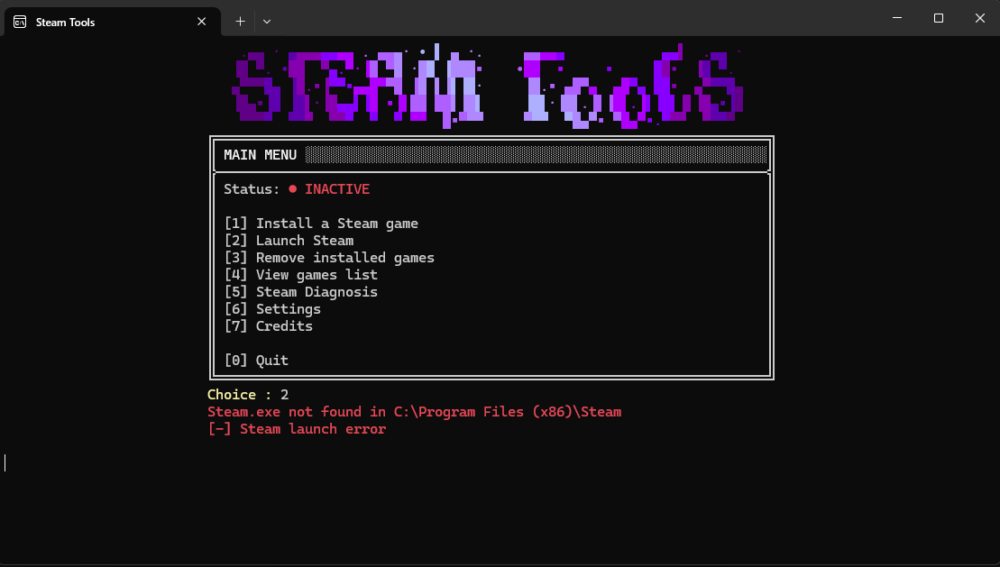
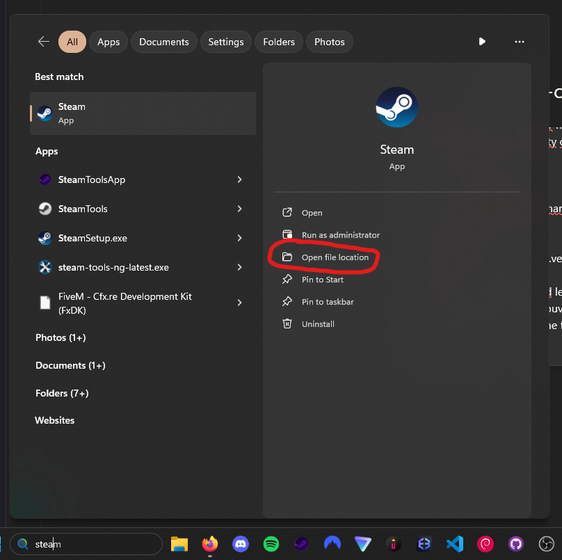
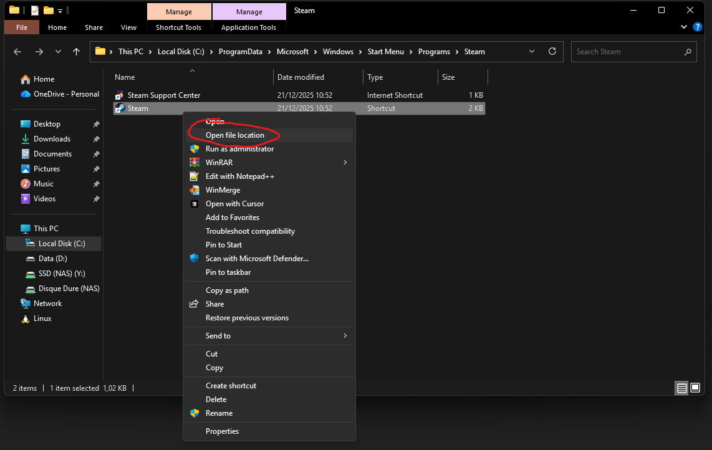
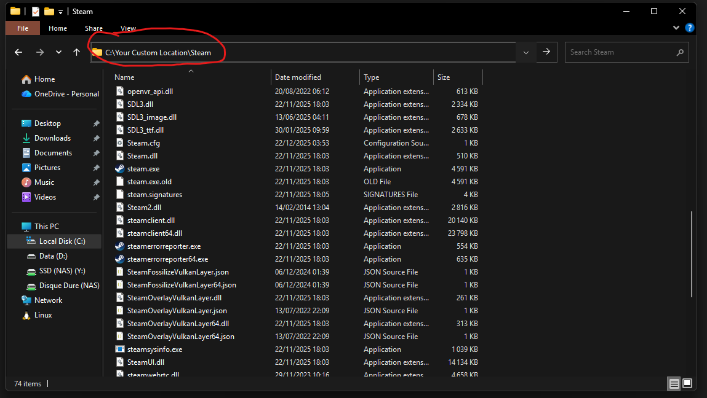
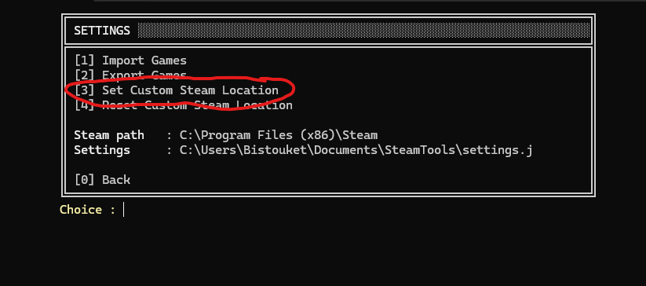
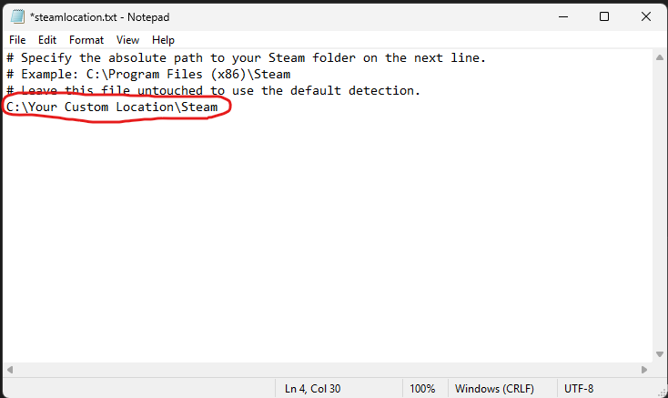

# Steam.exe not found

If you get the **"Steam.exe not found"** error when using SteamTools, it usually means that Steam’s installation path is not correctly set. Follow the steps below to fix it.

---

## 1. Locate Steam on Your PC 🔍

First, you need to find where **Steam is installed** on your computer.

**Steps:**
1. Open the **Windows search bar**.
2. Type **Steam**.
3. Right-click on **Steam** and select **Open file location**.

---

## 2. Access the Real Steam Folder 📁

You are now in the shortcut location. Next, you need the **actual installation folder**.

**Steps:**
1. Right-click on the **Steam shortcut**.
2. Click **Open file location** again.

---

## 3. Copy the Steam Path 📋

Once the Steam folder is open, you must copy its full path.

**Steps:**
1. Click on the **address bar** at the top of the File Explorer.
2. Copy the **full path** (for example: `C:\Program Files (x86)\Steam`).

> 💡 **Tip:** Make sure that the steam.exe file etc, is present in the folder.

---

## 4. Edit the SteamTools Configuration 🛠️

Now you need to tell **SteamTools** where Steam is installed.

**Steps:**
1. Open the **Documents** folder.
2. Open the folder named **SteamTools**.
3. Open the file **steamlocation.txt**.

---

## 5. Set the Correct Steam Path ✅

Finally, paste the Steam path into the correct line.

**Steps:**
1. Paste the copied path on the **4th line** of the file.
2. Save the file.
3. Close the text editor.

---

Once completed, restart **SteamTools**, and the **Steam.exe not found** error should be fixed.
